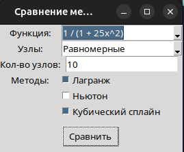
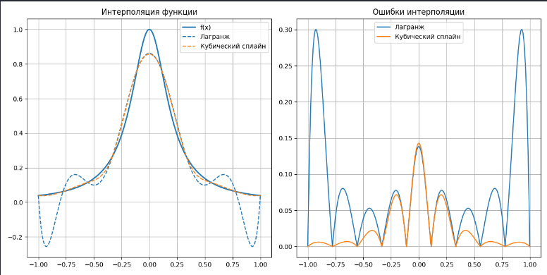

# SplineLAB

Анализ точности и устойчивости численных методов интерполяции с визуализацией графиков и метрик ошибок.

## 🧠 Тематика проекта

`interpolation` • `lagrange` • `newton` • `spline` • `chebyshev` •  
`function-approximation` • `curve-fitting` • `numerical-analysis` • `python` • `tkinter` • `scipy` • `data-visualization`

---

## 🔍 Возможности

- Построение интерполяции с использованием:
  - Полинома Лагранжа
  - Полинома Ньютона
  - Кубических сплайнов
- Поддержка различных узлов:
  - Равномерных
  - Узлов Чебышёва
- Сравнительный анализ методов:
  - Графики интерполяции
  - Графики абсолютной ошибки
  - Расчёт максимальной ошибки и MSE
- Интуитивно понятный интерфейс на `Tkinter`

## Пример работы

Ниже показан пример интерполяции функции:

